# Smart Home

Smart Home je sustav koji integrira razne IoT uređaje povezane unutar lokalne
mreže. Sustav omogućuje upravljanje uređajima preko desktop ili mobilne aplikacije.
Trenutno sustav uključuje uređaje za mjerenje kvalitete zraka i pametnu rasvjetu.
Sustav je osmišljen na način da u budućnosti podrži dodavanje novih uređaja te
da postoji samo jedna aplikacija za sve uređaje.
Komunikacija s uređajima odvija se koristeći
HTTP protokol i WebSocket tehnologiju.

### Mjerenje kvalitete zraka

Uređaj za mjerenje kvalitete zraka mjeri temperaturu,
vlažnost, tlak i koncentraciju PM2.5 čestice. Korisnik preko aplikacije može vidjeti trenutne i prošle vrijednosti. Uređaj lokalno sprema nedavna mjerenja, a po
mogućnosti, može slati mjerenja na backend poslužitelj radi
trajne pohrane. Uređaj se sastoji od ESP32 mikroupravljača,
različitih senzora te RTC (eng. Real Time Clock) modula za praćenje sata.

Dio aplikacije za taj uređaj je napravljen na način da podrži
korištenje stvarnog uređaja i virtualnog uređaja koristeći Dependency injection.

Neke značajke:
* mjerenje kvalitete zraka (prosječna vrijednost, minimalna i maksimalna),
* spremanje nedavnih mjerenja na uređaju,
* spremanje mjerenja u bazu podataka,
* pregled stanja uređaja (WiFi signal, iskorištenost RAM-a, itd.),
* upravljanje postavkama uređaja,
* podrška za stvarni i virtualni uređaj.

### Pametna rasvjeta

Uređaj za pametnu rasvjetu pruža različite svjetlosne
efekte i upravljanje rasvjetom putem aplikacije.
Uređaj se sastoji od ESP32 mikroupravljača, modula s pametnim lampicama i senzora za potrošnju električne energije. Uređaj podržava ažuriranje ugradbenog programa
preko aplikacije (OTA update).

Programski kod za izvođenje svjetlosnih efekata je dizajniran na način
da se može izvršavati na samom mikroupravljaču, ali i na Windows operacijskom sustavu radi bržeg prototipiranja.

## Dijagram arhitekture

U nastavku je prikazan dijagram arhitekture sustava. Aplikacija
komunicira s backend poslužiteljem i sa svakim uređajem. Uređaj
za mjerenje kvalitete zraka može slati podatke radi spremanja
u bazu.

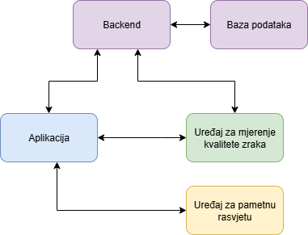

## Tehnologije i oprema

* Dart, Flutter
* Java, Quarkus
* C++, Arduino ESP32
* PostgreSQL

## Slike aplikacije

### Početna stranica za povezivanje uređaja

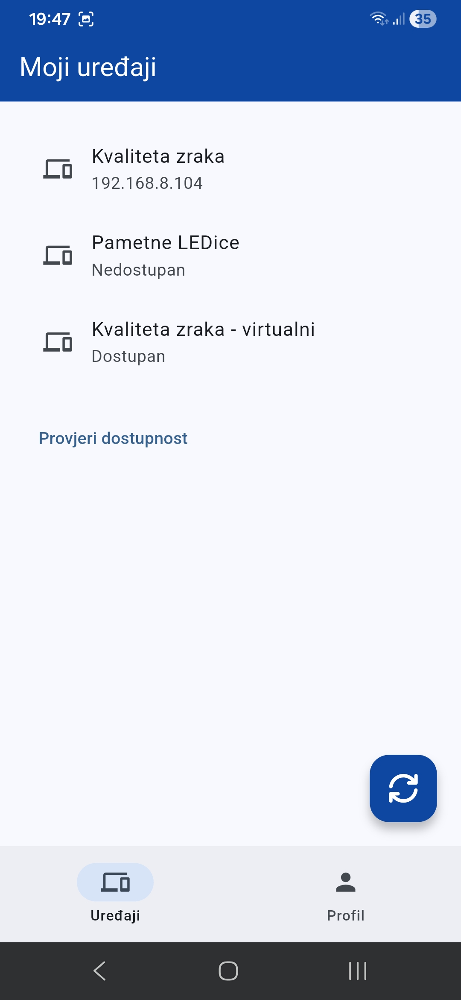

### Kvaliteta zraka - početna

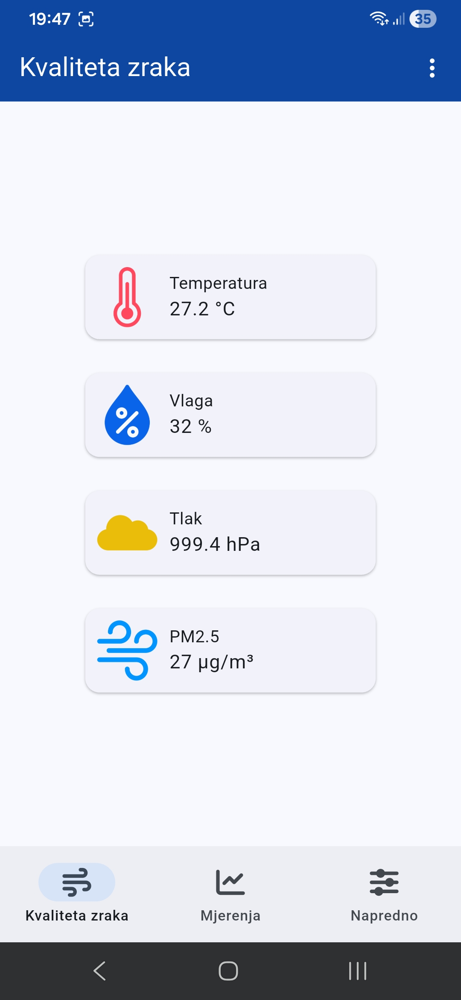

### Kvaliteta zraka - mjerenja

#### Uživo mjerenje kvaliete zraka kako pristižu podaci s uređaja

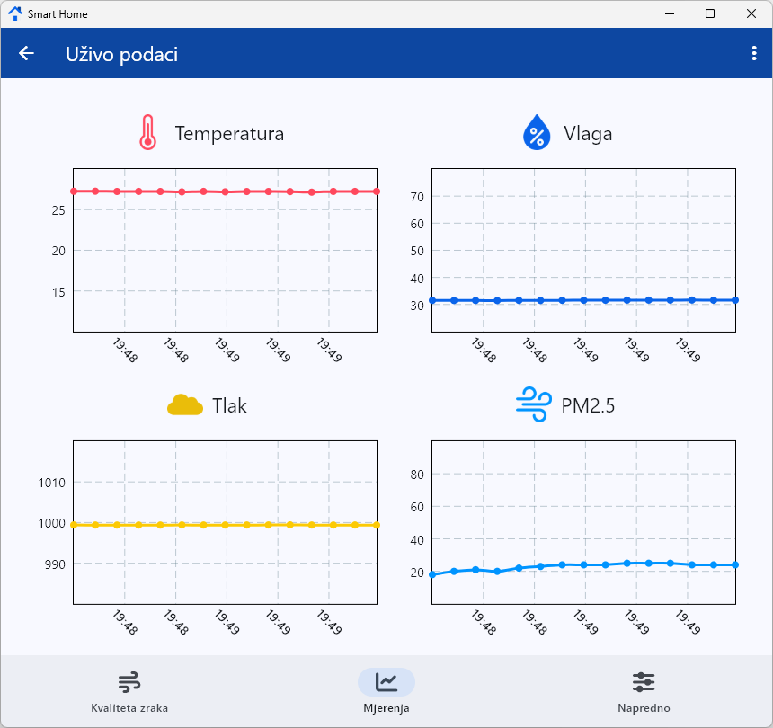

#### Prikaz nedavnih mjerenja pohranjenih lokalno na uređaju

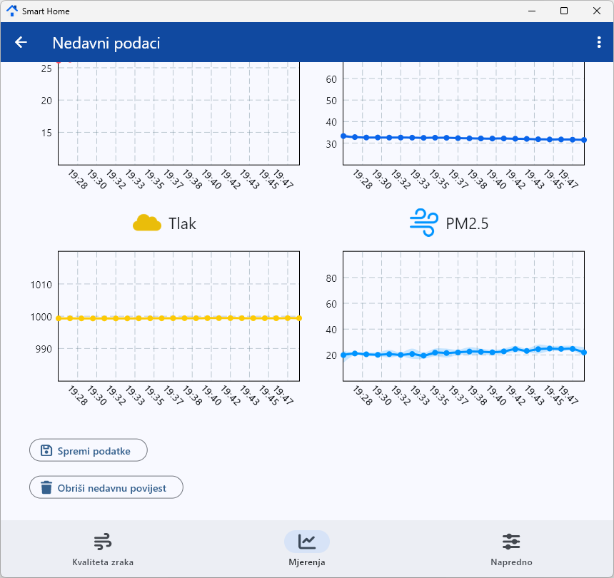

#### Povijesni podaci pohranjeni u bazi podataka

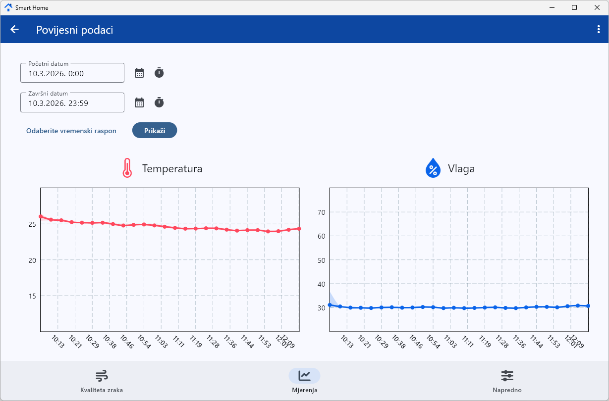

### Kvaliteta zraka - napredno

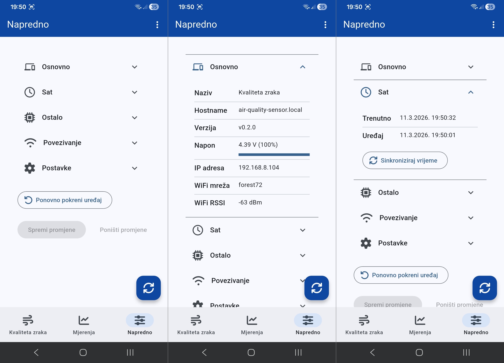

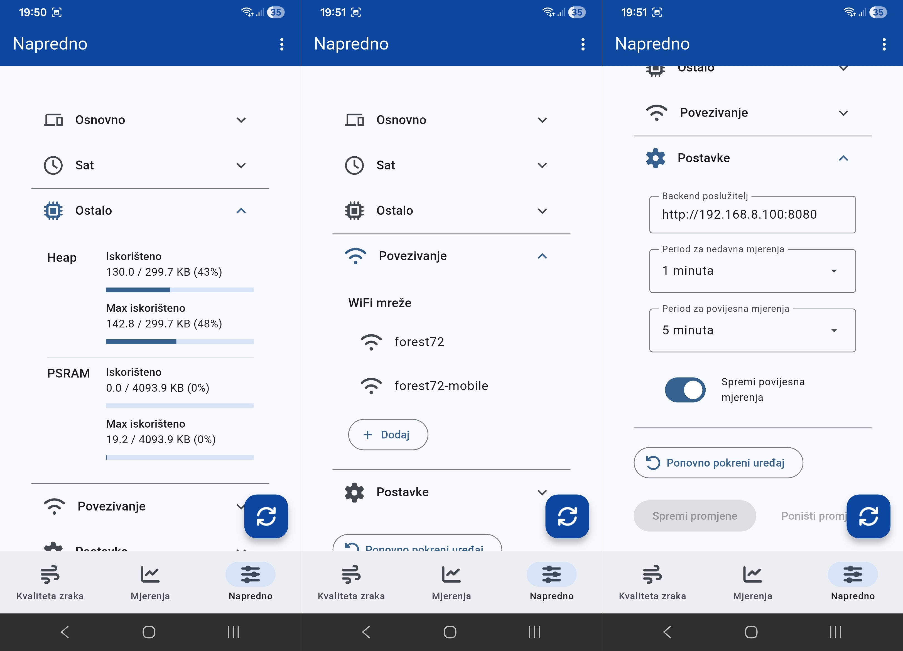

### Pametna rasvjeta - početna

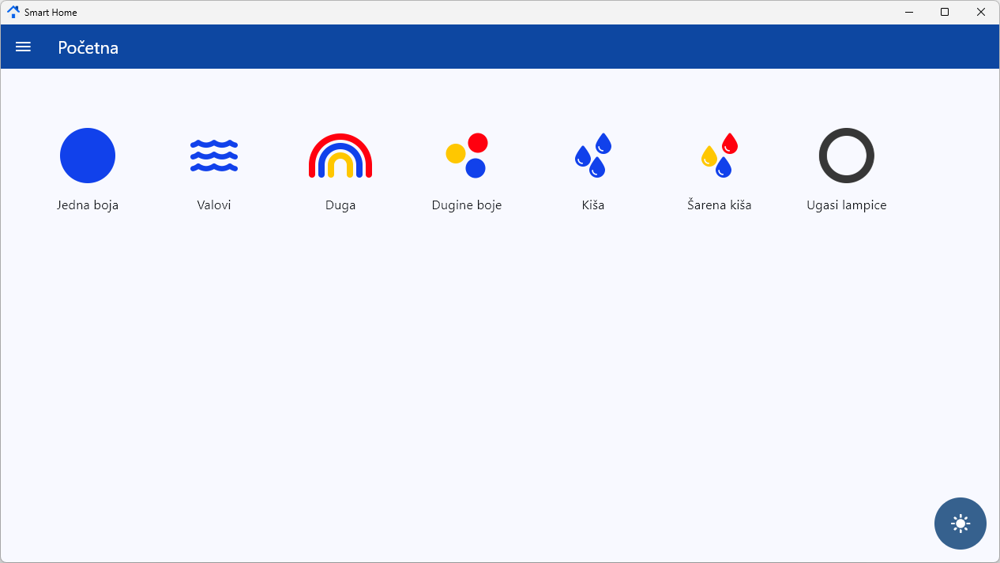

### Pametna rasvjeta - senzor energije

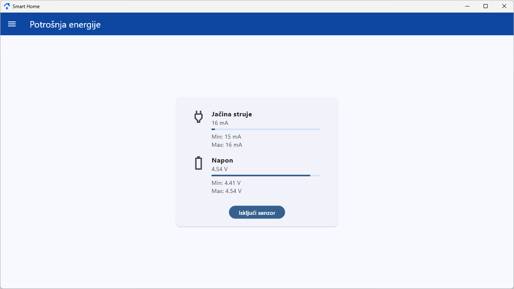

### Pametna rasvjeta - postavke i OTA ažuriranje

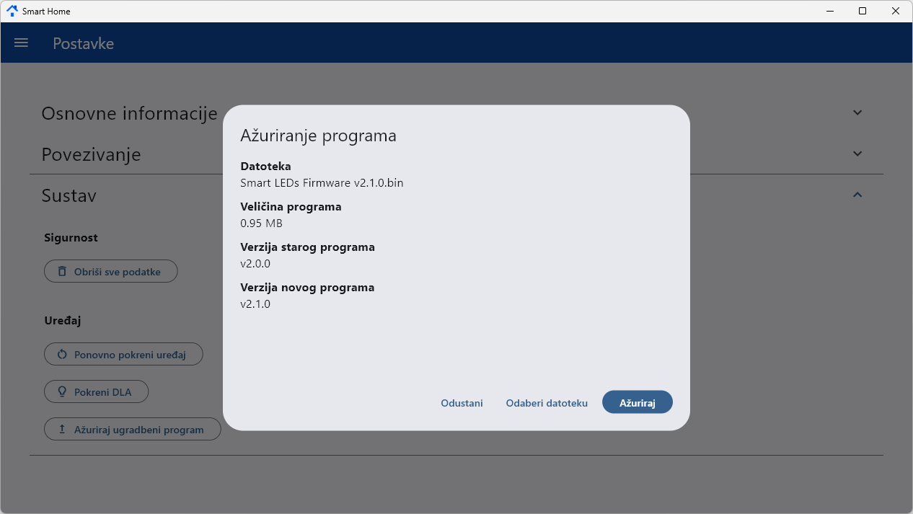

## Struktura repozitorija

Ovaj mono repozitorij sadrži više projekata koje čine Smart Home sustav, a u nastavku je ukratko objašnjen svaki projekt.

| Mapa | Opis |
|-|-|
| smart_home_app | Flutter projekt koji se odnosi na aplikaciju s kojom se upravljaju IoT uređaji. Struktura projekta je modularna radi lakšeg dodavanja novih uređaja. |
| smart_home_backend | Backend poslužitelj koji je zadužen za upravljanje korisničkim uređajima i pohranjivanje kvalitete zraka. Tehnologija: Java Quarkus. |
| air_qualiry_esp32 | PlatformIO projekt za ESP32 mikroupravljač koji se koristi za mjerenje kvalitete zraka. |
| smart_leds_esp32 | PlatformIO projekt za ESP32 mikroupravljač koji se koristi za pametnu rasvjetu. |
| misc | Razne skripte, pomoćni alati, slike. |
