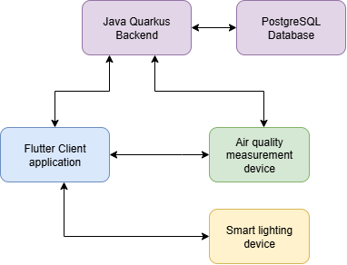

# Smart Home

  Smart Home is a system that integrates small IoT devices connected within a local network,
  providing a simple user experience. Smart Home supports air quality measuring devices and
  smart lighting. In the beginning, each device had its own application. That was not scalable
  and those applications were integrated into this one.

Key highlights:

<ul>
  <li>Caching the user profile and device list when the backend is not running</li>
  <li>Support for a virtual air quality device for development without hardware</li>
  <li>
    Support for local execution of lighting logic because uploading the firmware takes time
  </li>
</ul>

### Air quality measurement

<ul>
  <li>Air quality measurement (temperature, humidity, pressure, PM2.5)</li>
  <li>Saving recent measurements on the device</li>
  <li>Saving measurements to the database for permanent storage</li>
  <li>Overview of device status (WiFi signal, RAM usage, etc.)</li>
  <li>Manage device settings</li>
  <li>Real and virtual device support for development without hardware</li>
</ul>

### Smart lighting

<ul>
  <li>Lighting control</li>
  <li>Power consumption monitoring</li>
  <li>Firmware update using OTA (Over-the-air)</li>
  <li>Running the lighting effects code locally for faster development</li>
</ul>

## Technology stack
<ul>
  <li><b>Frontend:</b> Flutter (Android, Windows)</li>
  <li><b>Backend:</b> Java Quarkus</li>
  <li><b>Embedded:</b> C++, Arduino, ESP32 microcontroller</li>
  <li><b>Database:</b> PostgreSQL</li>
</ul>

## Architecture diagram

The client application communicates with the backend server and with each device.
The air quality measurement device can send data to the backend for permanent storage.

## Repository structure

This mono repository contains several projects that make up the whole system.

| Directory | description |
|-|-|
| smart_home_app | Flutter project for the client application for controlling IoT devices. Uses a modular structure for easier addition of a new device. Each device is a separate Dart package. |
| smart_home_backend | Backend using Java Quarkus |
| air_qualiry_esp32 | Contains firmware for the air quality device based on ESP32. |
| smart_leds_esp32 | Contains firmware for the smart lighting device based on ESP32. |
| misc | Some scripts and helper tools. |

## Project gallery
* [Link to project gallery](https://jmojzes21.github.io/portfolio_page/projects/smart-home#gallery)
